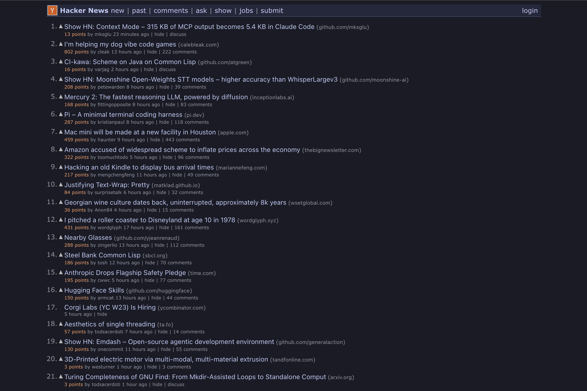

# DarkerNews

A dark mode browser extension for [Hacker News](https://news.ycombinator.com/), themed after [junesyi.dev](https://junesyi.dev).

## Install

1. Clone this repo (or download the folder)
2. Open `chrome://extensions` (Chrome) or `brave://extensions` (Brave)
3. Turn on **Developer mode** (top-right toggle)
4. Click **Load unpacked**
5. Select the `DarkerNews` folder
6. Go to [news.ycombinator.com](https://news.ycombinator.com/) — enjoy 🌙
